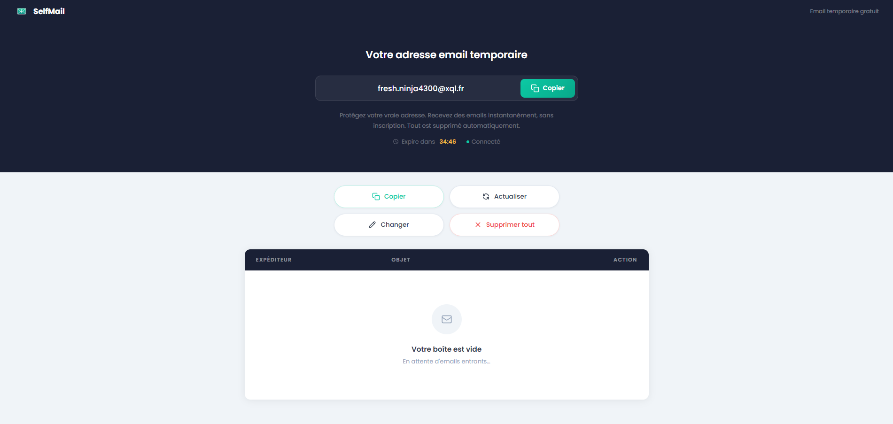



temp-mail open source love 

---

## Stack technique

| Couche         | Technologie                         |
| -------------- | ----------------------------------- |
| Frontend       | Node.js · Express · EJS · Socket.io |
| Backend API    | PHP 8.2 · Apache                    |
| Serveur email  | Mailpit (SMTP + REST API)           |
| Reverse proxy  | Nginx                               |
| Infrastructure | Docker · Docker Compose             |

---

## Prérequis

- [Docker Desktop](https://www.docker.com/products/docker-desktop/) (démarré)
- Ports libres : `80` (web), `8025` (Mailpit UI)

---

## Installation

```bash
# 1. Cloner le projet
git clone https://github.com/ton-utilisateur/SelfMail.git
cd SelfMail

# 2. Créer le fichier d'environnement
cp .env.example .env

# 3. Lancer tous les services
docker compose up --build -d

# 4. Ouvrir le navigateur
# Interface principale :  http://localhost
# Interface Mailpit :     http://localhost:8025
```

---

## Configuration

Édite le fichier `.env` :

```env
MAIL_DOMAIN=tempmail.local      # Domaine des adresses générées
HMAC_SECRET=change_me_secret    # Secret pour signer les tokens (changer en prod)
```

---

## Fonctionnement

1. À l'arrivée, une adresse email est générée automatiquement (ex: `swift.wolf1234@tempmail.local`)
2. Le token de session est signé avec HMAC-SHA256 et stocké dans `localStorage`
3. Les emails sont reçus via **Mailpit SMTP** et poussés en temps réel via **Socket.io**
4. La session expire après **1 heure** — les données sont supprimées automatiquement

---

## Architecture

```
Browser
  │
  └── Nginx :80
        ├── /api/*  →  PHP 8.2 (Apache)  →  Mailpit REST API
        └── /*      →  Node.js (Express + Socket.io)
                              │
                          Socket.io polling Mailpit toutes les 3s
```

---

## API PHP

| Méthode  | Route                           | Description                |
| -------- | ------------------------------- | -------------------------- |
| `GET`    | `/api/mailbox/generate`         | Génère une adresse + token |
| `GET`    | `/api/mailbox/emails?token=`    | Liste les emails           |
| `GET`    | `/api/mailbox/email/:id?token=` | Contenu d'un email         |
| `DELETE` | `/api/mailbox/email/:id`        | Supprime un email          |
| `DELETE` | `/api/mailbox/delete`           | Supprime toute la boîte    |

---

## Structure des fichiers

```
SelfMail/
├── backend/
│   ├── index.php               # Router API
│   ├── .htaccess               # Rewrite rules Apache
│   ├── Dockerfile
│   └── lib/
│       ├── MailpitClient.php   # Client REST Mailpit
│       ├── RateLimiter.php     # Rate limiting par IP
│       └── Session.php         # Génération email + tokens HMAC
├── frontend/
│   ├── server.js               # Express + Socket.io
│   ├── Dockerfile
│   ├── package.json
│   ├── views/
│   │   └── index.ejs           # Interface principale
│   └── assets/
│       ├── css/input.css
│       └── js/app.js           # Logique client
├── nginx/
│   └── nginx.conf              # Reverse proxy
├── docker-compose.yml
├── .env.example
└── README.md
```

---

## Commandes utiles

```bash
# Voir les logs
docker compose logs -f

# Redémarrer un service
docker compose restart node-frontend
docker compose restart php-api

# Arrêter tout
docker compose down

# Rebuild complet (standard)
docker compose up --build -d

# Rebuild propre (efface le cache et force la recréation si 502 Bad Gateway etc.)
docker builder prune -a -f
docker compose up --build --force-recreate -d

# Envoyer un email de test (PowerShell)
$bytes = [System.Text.Encoding]::UTF8.GetBytes('{"from":{"Email":"test@example.com"},"to":[{"Email":"votre-adresse@tempmail.local"}],"subject":"Test","text":"Hello !"}')
Invoke-WebRequest -Uri "http://localhost:8025/api/v1/send" -Method POST -ContentType "application/json; charset=utf-8" -Body $bytes
```

---

## Sécurité

- Emails HTML affichés dans un `iframe` sandboxé
- Tokens HMAC-SHA256 avec TTL 1h
- Rate limiting par IP côté PHP
- Pas de base de données — aucune donnée persistée côté serveur

---

## Licence

MIT
